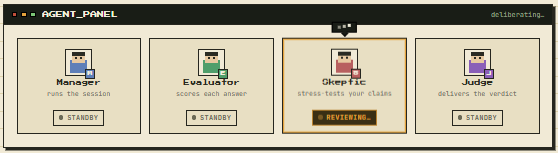
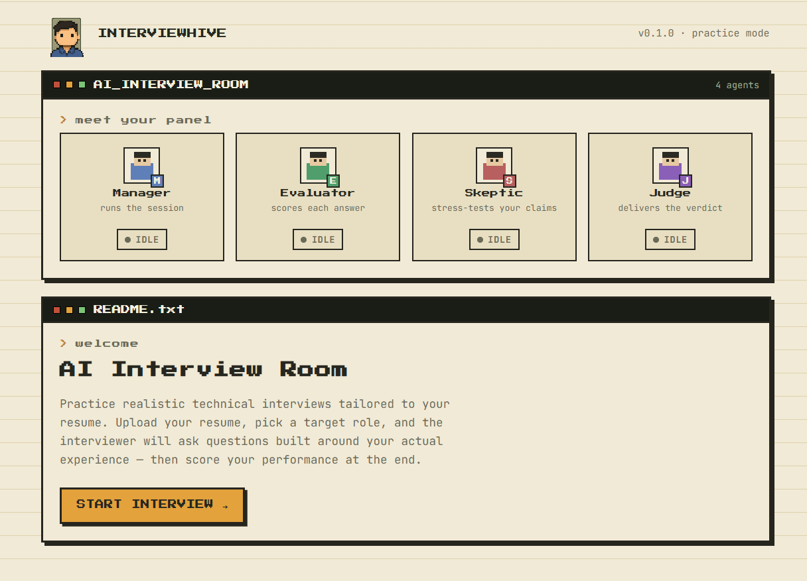
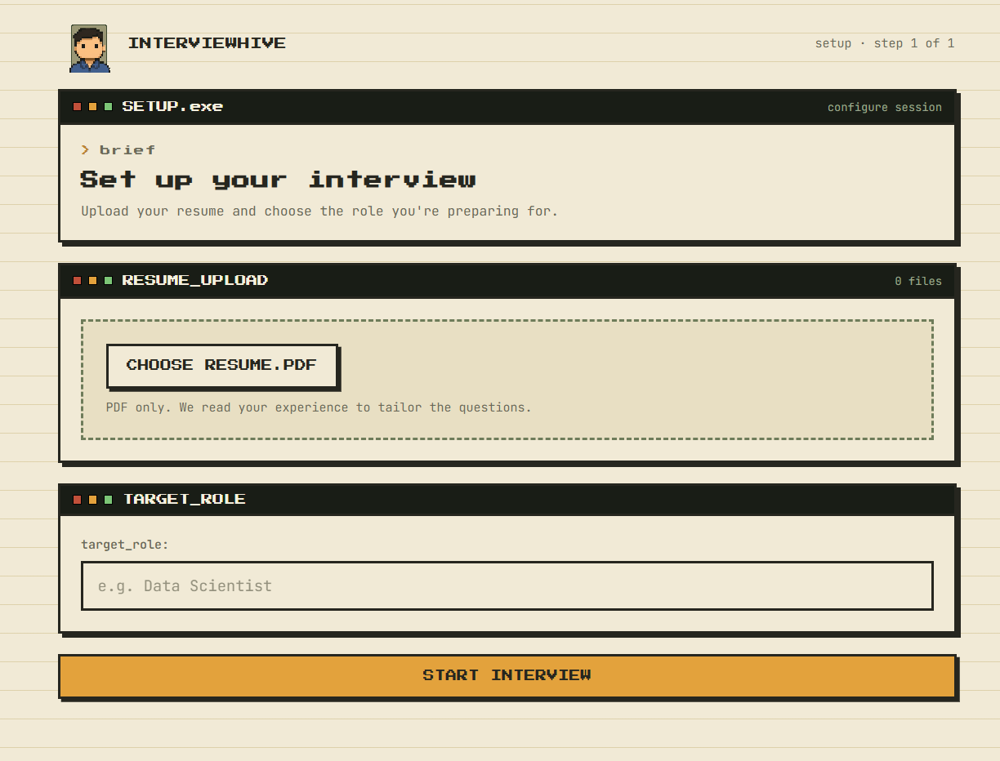
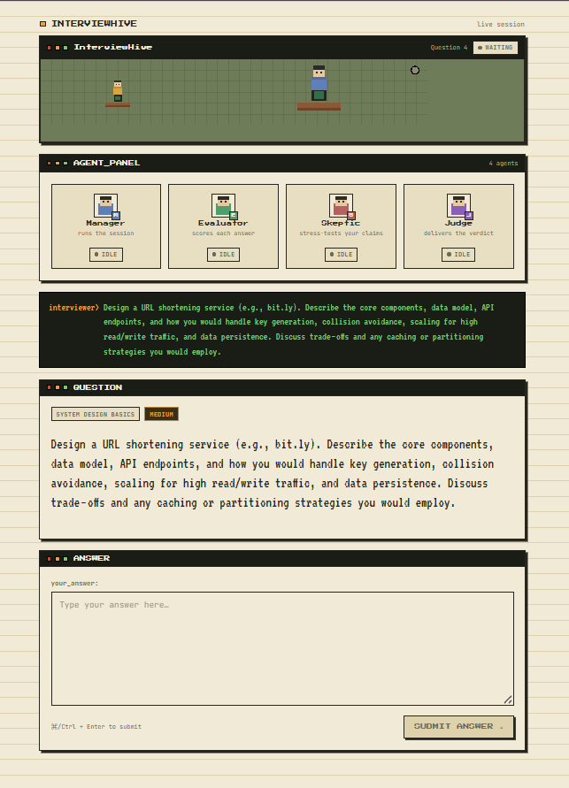

# 🐝 InterviewHive
<p align="center">
  
</p>


<div align="center">
  
### AI-Powered Adaptive Technical Interview Platform

**Practice technical interviews with an AI interview panel that thinks, adapts, challenges, and evaluates.**

[](https://www.python.org/)
[](https://fastapi.tiangolo.com/)
[](https://react.dev/)
[](https://groq.com/)
[](https://www.sbert.net/)
[](https://pixijs.com/)

### 🚀 [Try InterviewHive](https://interview-hive-kappa.vercel.app/)

</div>


## 🧠 Overview

**InterviewHive** is an AI-powered technical interview platform designed to simulate a realistic, adaptive interview experience.

Traditional interview practice platforms usually follow a predefined question list.

InterviewHive takes a different approach.

It analyzes the candidate's **resume and target role**, creates an interview blueprint, dynamically generates questions, evaluates answers, challenges weak responses, adapts question difficulty, and produces a detailed final interview report.

### The goal is simple:

> **Don't just practice questions. Practice being interviewed.**

## ✨ Key Features

### 📄 Resume-Based Interview

Upload your resume and InterviewHive extracts relevant information such as:

* Education
* Skills
* Projects
* Experience
* Certifications
* Achievements

The extracted profile is used to personalize the interview.

### 🎯 Role-Aware Interview

The system analyzes the candidate's target role and creates an interview blueprint containing:

* Priority topics
* Technical skills
* Project areas
* Competencies
* Interview focus
* Difficulty level

This prevents the interview from becoming a generic question-answer session.

### 🤖 Multi-Agent Interview System

InterviewHive uses multiple specialized AI agents instead of relying on a single prompt.

| Agent                | Responsibility                                        |
| -------------------- | ----------------------------------------------------- |
| 🧑‍💼 Manager Agent  | Controls interview flow and decides what happens next |
| 🎤 Interviewer Agent | Presents questions naturally                          |
| 🧪 Evaluator Agent   | Evaluates the candidate's answer                      |
| 🧐 Skeptic Agent     | Looks for gaps and weak reasoning                     |
| ⚖️ Judge Agent       | Generates the final interview assessment              |

Each agent has a specific responsibility within the interview pipeline.

## 🔄 Adaptive Interview Flow

The interview is not completely predetermined.

After every candidate answer:

```text
Candidate Answer
       │
       ▼
Evaluator Agent
       │
       ├── Technical Accuracy
       ├── Depth
       ├── Reasoning
       ├── Clarity
       ├── Communication
       └── Confidence
       │
       ▼
Skeptic Agent
       │
       ├── Strong Answer
       │
       └── Potential Gap
              │
              ▼
        Manager Agent
              │
       ┌──────┼─────────┐
       ▼      ▼         ▼
    Continue Challenge  Finish
       │      │
       │      └── Follow-up Question
       │
       ▼
 Generate New Question
       │
       ▼
 Interviewer Agent
```

This creates a more realistic interview loop.

## Agent Architecture
<p align="center">
  
</p>

## 1. 🧑‍💼 Manager Agent

The Manager acts as the **interview controller**.

It considers:

* Previous evaluations
* Candidate performance
* Topics already covered
* Difficulty
* Skeptic feedback
* Interview progress

It decides whether to:

```text
CONTINUE
CHALLENGE
FINISH
```

## 2. 🎤 Interviewer Agent

The Interviewer Agent converts the generated question into a natural interview interaction.

It considers:

* Current question
* Candidate profile
* Conversation history
* Manager decision
* Previous candidate answer

This makes the interaction feel less like a static questionnaire.

## 3. 🧪 Evaluator Agent

The Evaluator analyzes every candidate answer.

It scores:

```text
Technical Accuracy
Depth
Reasoning
Clarity
Communication
Confidence
Overall Performance
```

It also identifies:

* Strengths
* Weaknesses
* Missing concepts
* Whether the candidate should be challenged
* Suggested follow-up direction


## 4. 🧐 Skeptic Agent

The Skeptic acts as the **critical reviewer**.

Instead of accepting every answer at face value, it looks for:

* Unsupported claims
* Missing concepts
* Weak reasoning
* Technical inconsistencies
* Areas that deserve deeper questioning

If necessary, it generates a challenge question.


## 5. ⚖️ Judge Agent

After the interview finishes, the Judge analyzes the complete interview history.

It produces a final report containing:

* Overall score
* Technical score
* Problem-solving score
* Communication score
* Confidence score
* Depth score
* Strengths
* Weaknesses
* Red flags
* Recommended topics
* Final summary


### 📄 Resume Processing Pipeline

The resume processing system follows a structured pipeline.

```text
Resume PDF
    │
    ▼
PyMuPDF
    │
    ▼
Text Extraction
    │
    ▼
Text Cleaning
    │
    ▼
Section Detection
    │
    ├── Education
    ├── Experience
    ├── Projects
    ├── Skills
    ├── Certifications
    └── Achievements
    │
    ▼
Resume Context
    │
    ▼
LLM Extraction
    │
    ▼
CandidateProfile
```

The extracted information is validated using **Pydantic models** before being used by the interview system.


### 🎯 Question Generation

Questions are generated dynamically according to:

* Target topic
* Difficulty
* Question type
* Previously asked questions

Example:

```text
Topic:
Machine Learning

Difficulty:
Medium

Question Type:
Technical
```

The LLM generates:

```json
{
  "question": "...",
  "topic": "Machine Learning",
  "difficulty": "medium",
  "question_type": "technical",
  "expected_concepts": [
    "...",
    "..."
  ]
}
```


### 🔁 Question Deduplication

InterviewHive also checks whether a newly generated question is too similar to previously asked questions.

It uses:

```text
Sentence Transformer
        │
        ▼
Question Embeddings
        │
        ▼
Cosine Similarity
        │
        ▼
Similarity Threshold
        │
        ▼
Duplicate / Unique
```

The embedding model used is:

```text
all-MiniLM-L6-v2
```

If a generated question is too similar to an earlier question, the system attempts to generate another one.

---

### 📈 Adaptive Difficulty

The interview can adjust difficulty according to candidate performance.

```text
Strong Answer
      │
      ▼
Increase Difficulty
```

```text
Weak / Shallow Answer
      │
      ▼
Decrease Difficulty
```

```text
Acceptable Answer
      │
      ▼
Maintain Difficulty
```

The supported levels are:

```text
Easy → Medium → Hard
```

## System Architecture

```text
                         ┌──────────────────┐
                         │     React UI     │
                         │     + PixiJS     │
                         └────────┬─────────┘
                                  │
                                  │ REST API
                                  ▼
                         ┌──────────────────┐
                         │     FastAPI      │
                         │     Backend      │
                         └────────┬─────────┘
                                  │
                 ┌────────────────┼────────────────┐
                 │                │                │
                 ▼                ▼                ▼
          Resume Parser      Interview Engine   Report Engine
                 │                │                │
                 ▼                ▼                ▼
          Candidate Profile   AI Agents        Judge Agent
                                  │
                 ┌────────────────┼────────────────┐
                 │                │                │
                 ▼                ▼                ▼
             Manager        Interviewer       Evaluator
                                  │
                                  ▼
                               Skeptic
                                  │
                                  ▼
                            Groq LLM API
```


## Tech Stack

| Category        | Technology            | Purpose                               |
| --------------- | --------------------- | ------------------------------------- |
| Frontend        | React                 | Application UI                        |
| UI Graphics     | PixiJS                | Interactive interview-room experience |
| Backend         | FastAPI               | REST API                              |
| Language        | Python                | Backend and AI pipeline               |
| LLM             | Groq                  | AI agent inference                    |
| Model           | GPT-OSS 120B          | Interview reasoning and generation    |
| NLP             | Sentence Transformers | Question similarity                   |
| Embeddings      | all-MiniLM-L6-v2      | Semantic representations              |
| PDF Processing  | PyMuPDF               | Resume extraction                     |
| Validation      | Pydantic              | Structured data validation            |
| Data Processing | Pandas, NumPy         | Data processing                       |
| ML              | Scikit-learn          | Similarity / ML utilities             |
| Deployment      | Vercel + Render       | Frontend + backend deployment         |


## API Flow

The frontend communicates with the FastAPI backend through REST APIs.

High-level flow:

```text
Frontend
   │
   ├── Upload Resume
   │
   ▼
Resume API
   │
   ▼
Candidate Profile
   │
   ▼
Interview Setup
   │
   ▼
Interview API
   │
   ├── Generate Question
   ├── Submit Answer
   ├── Evaluate Answer
   ├── Challenge
   └── Continue / Finish
   │
   ▼
Report API
   │
   ▼
Final Interview Report
```


## Configuration

The backend requires a Groq API key.

Create a `.env` file inside the backend:

```env
GROQ_API_KEY=your_api_key_here
```

Do **not** commit your API key to GitHub.

The `.env` file should remain in `.gitignore`.


## ⚙️ Local Development

### 1. Clone the repository

```bash
git clone https://github.com/bhumi110/InterviewHive.git

cd InterviewHive
```

### 2. Backend Setup

```bash
cd backend

python -m venv venv
```

### Windows

```bash
venv\Scripts\activate
```

Install dependencies:

```bash
pip install -r requirements.txt
```

Create `.env`:

```env
GROQ_API_KEY=your_api_key_here
```

Run the API:

```bash
uvicorn app.main:app --reload
```

The backend will be available at:

```text
http://localhost:8000
```

FastAPI documentation:

```text
http://localhost:8000/docs
```


## 3. Frontend Setup

Open another terminal:

```bash
cd frontend

npm install
```

Run the development server:

```bash
npm run dev
```

The frontend will normally run at:

```text
http://localhost:5173
```


## 🚀 Deployment

InterviewHive is deployed using:

```text
Frontend → Vercel
Backend  → Render
```

The frontend communicates with the deployed FastAPI backend through the configured API URL.

For production deployment, configure the backend environment variable:

```env
GROQ_API_KEY=your_production_api_key
```

and configure the frontend API base URL to point to the deployed backend.


## Current Architecture Notes

InterviewHive intentionally does **not** require:

* User authentication
* A database
* Persistent user accounts

Interview sessions are maintained in application memory.

This keeps the project lightweight and makes it suitable for demonstration, portfolio, and interview purposes.


### 💡 Why This Project?

InterviewHive was built to explore how multiple AI components can work together as a coordinated system rather than using one large prompt.

The project combines:

```text
Resume Parsing
       +
Role Analysis
       +
LLM Agents
       +
Structured Outputs
       +
Semantic Similarity
       +
Adaptive Decision Making
       +
FastAPI
       +
Interactive React/PixiJS UI
```

The result is an end-to-end AI application rather than a standalone ML model or chatbot.


### Learning Outcomes

This project demonstrates practical experience with:

* LLM application development
* Multi-agent architecture
* Prompt engineering
* Structured LLM outputs
* Pydantic validation
* Resume parsing
* NLP embeddings
* Semantic similarity
* Adaptive decision systems
* REST API development
* FastAPI
* React
* PixiJS
* Frontend/backend integration
* Environment configuration
* Cloud deployment
* AI system debugging


### Future Improvements

Possible future extensions include:

* 🎙️ Voice-based interviews
* 🗣️ Speech-to-text answers
* 🔊 AI-generated interviewer voice
* 📊 Historical performance tracking
* 🗄️ Persistent database support
* 👤 Authentication and candidate profiles
* 📈 Interview performance analytics
* 🎯 Personalized preparation plans
* 🧠 More specialized interview agents
* 💻 Live coding interview support


## 🌟 What Makes InterviewHive Different?

Most interview practice tools follow:

```text
Question → Answer → Next Question
```

InterviewHive follows:

```text
Resume
   ↓
Role Analysis
   ↓
Interview Blueprint
   ↓
Question
   ↓
Candidate Answer
   ↓
Evaluation
   ↓
Critical Review
   ↓
Manager Decision
   ↓
Adaptive Follow-up
   ↓
Next Question
   ↓
Final Judge
   ↓
Personalized Report
```

The interview **responds to the candidate**, rather than simply moving through a question list.

---

⭐ If you found InterviewHive interesting, consider giving the repository a star!

> Contributions are welcome! If you have an idea for improving InterviewHive, fixing a bug, improving the UI, adding an AI agent, or extending the interview system, feel free to contribute.

## 📸 Preview

<p align="center">
  
    
</p>

<!-- <p align="center">
  
</p> -->
